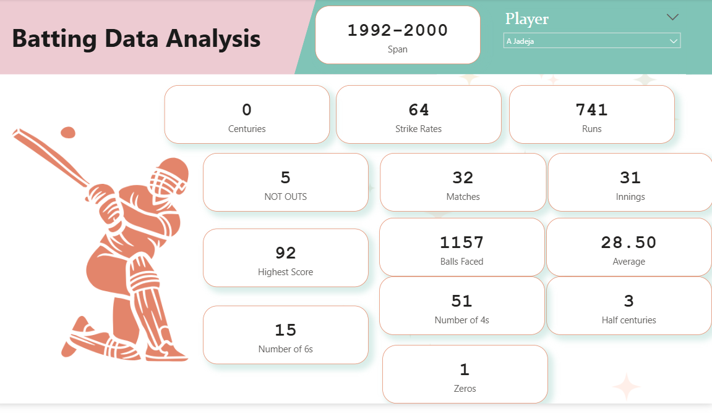
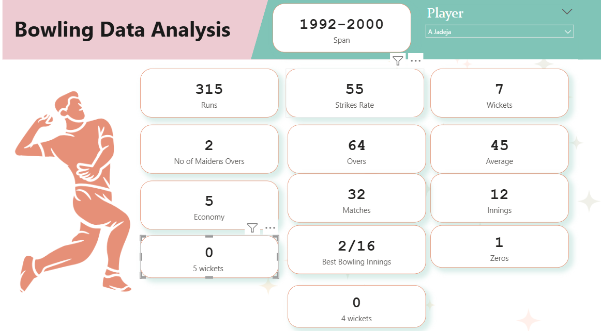
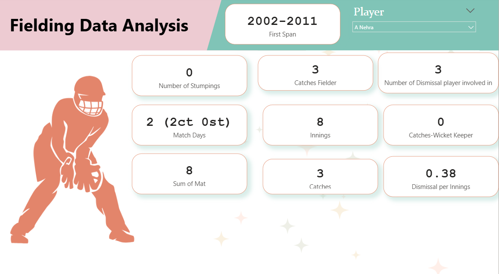

# 🏏 ESPN Cricket Data Analysis (Power BI)

📊 An end-to-end **cricket analytics project** built using **Power BI**, leveraging **web-scraped ESPN data** to analyze **batting, bowling, and fielding performance** of players across multiple years.

---

## 📌 Project Overview
This project is part of ESPN Cricket Data Analysis (Data Source: Web)** from a data analytics course.  
The project demonstrates how to **scrape live sports data from the web**, clean it, model it, and build **interactive Power BI reports**.

---

## 🎯 Business / Analytical Objectives
- Collect cricket statistics directly from ESPN using web scraping  
- Clean and standardize batting, bowling, and fielding data  
- Analyze player performance across different spans  
- Provide player-level insights using interactive slicers  

---

## 🧠 Key Analysis Areas
- **Batting Analysis**: Runs, averages, strike rate, centuries, boundaries  
- **Bowling Analysis**: Wickets, economy, overs, best bowling figures  
- **Fielding Analysis**: Catches, stumpings, dismissals involved  

---

## 🛠 Tools & Skills Used
- Power BI  
- Web scraping (ESPN website)  
- Power Query (data cleaning & transformation)  
- DAX (LOOKUPVALUE, RANKX, POWER, ABS)  
- Interactive slicers & span cards  
- Report design & storytelling  

---

## 📊 Report Pages
- Batting Data Analysis  
- Bowling Data Analysis  
- Fielding Data Analysis  

Each page supports:
- Player selection  
- Career span filtering  
- KPI cards for quick insights  

---

## 📸 Report Screenshots

### 🏏 Batting Data Analysis

---

### 🎯 Bowling Data Analysis

---

### 🧤 Fielding Data Analysis

---

## ▶️ How to Use
1. Open the Power BI report file (`.pbix`)  
2. Refresh data (if web connection is enabled)  
3. Use player slicers to explore individual performance  
4. Switch between batting, bowling, and fielding pages  

---

## 🎓 Learning Outcomes
- Real-world web scraping in Power BI  
- Strong Power Query data cleaning skills  
- Advanced DAX usage for ranking and categorization  
- Multi-page interactive report design  
- Sports analytics use case for portfolio  

---

